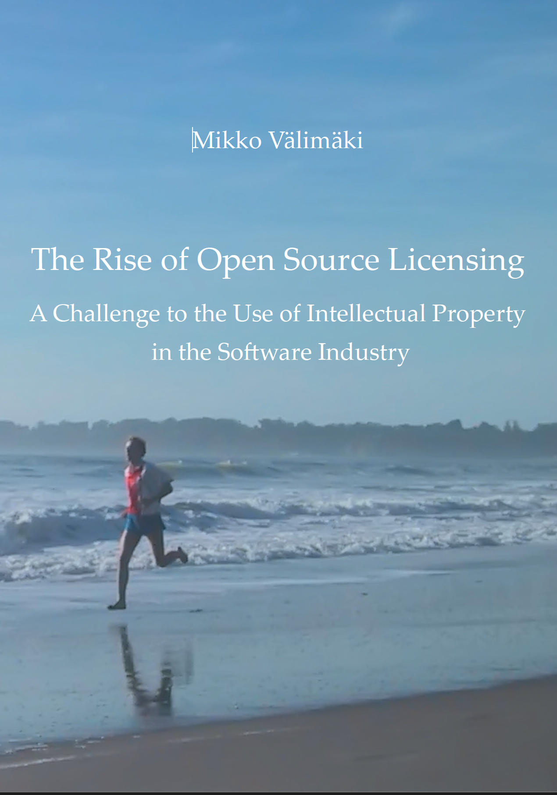

##  书名

《开源许可的崛起：软件产业界采用知识财产权的挑战》

英文原名：《The Rise of Open Source Licensing:A Challenge to the Use of Intellectual Property in the Soft ware Industry》

## 封面

## 内容简介

从 Linux 到 Firefox 和 MySQL 数据库，开源软件改变了我们对软件产业的认识。新创公司以创新的版权许可策略和勇敢的反专利政策，向从微软到甲骨文等业界重量级公司发起了挑战。几乎所有大型软件公司都不得不对这样的商品化趋势做出应对。

本书通过详细的案例研究、历史叙述和经济理论的应用，展示了如何利用开源许可来获得战略优势。软件开发者进入开源领域，是为了更有效地发布他们的作品，提高创新能力。他们说，软件不再是财产。有趣的是，尽管一切都进展顺利，但并不是因为知识产权。

但是也并非是一帆风顺，在美国，SCO 针对 Linux 支持者和用户的头条案件揭开了知识产权侵权风险的序幕。在欧洲，关于软件专利对开放源代码的影响的公开辩论仍在继续。本书超越了恐惧和怀疑，认为这些法律风险最终只是必要但可控的不确定性，而这些不确定性总是伴随着新的商业模式而来。

## 作者简介

Mikko Välimäki 在赫尔辛基理工大学教授技术法。他曾就开放源代码许可问题为大家提供咨询。

## 推荐理由

开源该如何正确对待，我指的是商业上的处理，开源并非商业的对立面，反而是相当友好的一面，将比例原则实现的较好的方式，但是怎么做到的，那么你应该阅读一下本书。一定给你清晰的认识。

 -- By <a href="https://opensourceway.community/">适兕</a>  作者,「开源之道」主创，「OSCAR·开源之书·共读」发起者和记录者

