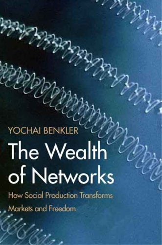

##  书名

《网络的财富：社会生产如何改变市场和自由》

英文原名：《The Wealth of Networks：How Social Production Transforms Markets and Freedom》

## 封面

## 内容简介

Yochai Benkler 在这本发人深省的书中说，随着互联网对信息生产的彻底变革，我们正处于一个重要的转型时刻。作者对社会生产（social production）进行了描述，而且认为这种现象正在重塑我们的市场，同时还为增强个人自由、文化多样性、话语和正义提供了新的机会。在这个关于互联网和网络信息经济的综合社会理论中，作者描述了信息、知识和文化生产的模式是如何变化的——并表明信息和知识的获取方式可以限制或扩大人们创造和表达自己的方式。

## 作者简介

尤查•本科勒（Yochai Benkler）

* 哈佛大学法学教授，哈佛大学伯克曼互联网与社会中心主任，TED演讲人，圣塔菲研究所公开演讲人，跨学科研究的先锋。

* 互联时代知识传播、知识产权研究领域颇有建树的权威。2012年获牛津大学互联网学院“终身成就奖”，2011年获福特基金会“远见奖”，2007年获电子前哨基金会“先锋奖”，2006年获得非营利性组织“公共知识”（Public Knowledge ）颁发的IP3奖。

* 知识共享理念的推动者，他的著作《网络财富》就是“知识共享”版权许可的。“知识共享”运动发起人劳伦斯•莱斯格称他为“信息时代最了不起的天才”。

## 推荐理由

想要更加彻底的理解网络所带来的全新生产模式，比如开源，一个更加极端的方式是参考历史上的封闭环境，当然不是从这本书上去了解历史，而是说社会生产需要一个参考的系统。

## 推荐人

[适兕](https://opensourceway.community/all_about_kuosi)，作者，「开源之道」主创。「OSCAR·开源之书·共读」发起者和记录者。