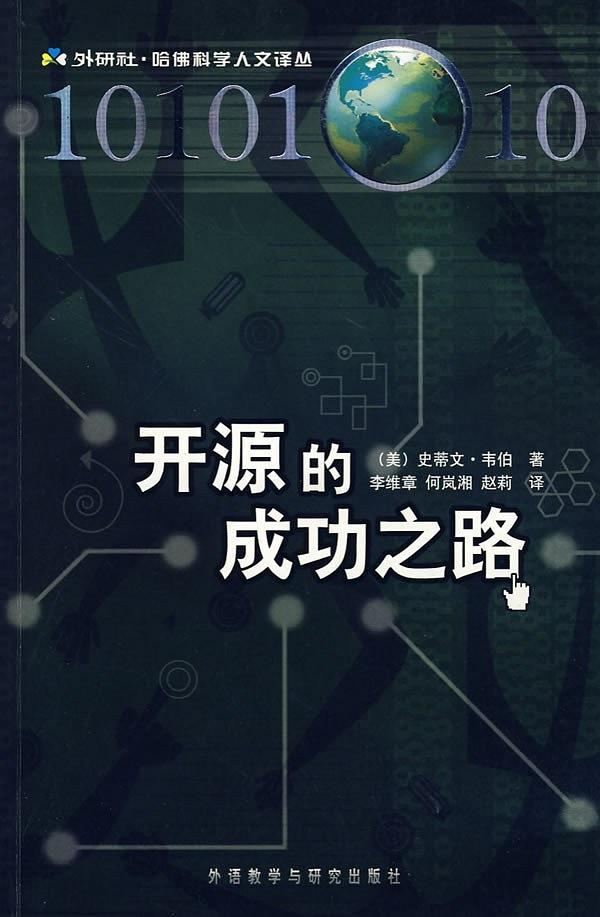

##  书名

《开源的成功之路》

英文原名：《The Success of Open Source》

## 封面

## 内容简介

开源共同体首创精神的意义尤为深远。通过探讨构成财产的基本概念，该共同体重新改写了一些最基本的管理问题。与此同时，它正在重建软件世界的政治学和经济学。假如您就像作者一样深信，在未来，软件构成的一些核心工具和原则将指导人类如何协同工作，协助人们创造财富并开创美好的未来，寻求新思想和新问题的解决方案，那么，理解开源如何改变这些过程至关重要。作为一名政治学家，作者更关心共同体的治理方式，而非技术本身。作者之所以对开源产生兴趣，正是因为这个新兴的技术共同体似乎能够以一种非常新奇而动人的方式，解决在作者看来相当棘手但常见的基本治理问题。

开源的本质是政治，这是本书提出的一个令人振聋发聩的观点，过去的几十年证明了这个观点的适用性。

## 推荐理由

如果我们将开源视为技术的一种协作模式，显然是彻底的失误，从财产和所有权的角度来讲，开源是数字世界中全新的分配方式，既能让技术不断进行创新，也能让所有的参与者得到公平的回报。

## 推荐人

[适兕](https://opensourceway.community/all_about_kuosi)，作者，「开源之道」主创。「OSCAR·开源之书·共读」发起者和记录者。