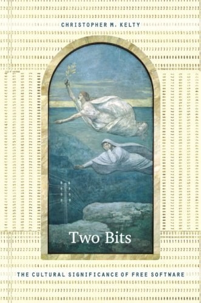

##  书名

《两个比特: 自由软件的文化意义》

英文原名：《Two Bits：The Cultural Significance of Free Software》

## 封面

## 内容简介

在这本 Two Bits 书中，Christopher M. Kelty 调查了自由软件的历史和文化意义，揭示了那些不仅彻底改变了软件产业，也改变了音乐、电影、科学和教育等领域的人们以及他们的实践。从波士顿的一家互联网医疗保健初创公司到柏林的媒体实验室，再到班加罗尔的年轻企业家，Kelty利用民族志等研究方法，描述了将Hacker、极客、律师和其他自由软件倡导者联系在一起的技术和道德愿景。在每个案例下下，他都展示了这些人的实践和生活方式： 不仅包括共享软件等源代码，还包括将开放视为首要、编写版权许可、协调合作和为运动作宣传的方式等等。通过详细探索这些实践是如何在 1970 年代到 1990 年代的自由软件运动中融合在一起的：Kelty 还深入到诸如创建版权许可的非营利组织 Creative Commons、创建在线学术教科书共享项目 Connexions 等项目。

## 作者简介

Christopher M. Kelty 是莱斯大学人类学助理教授。

## 推荐理由

民族志视角下的自由和开源，是不同于工程和商业视角下的，在他们眼里：全都是文化！文化指导一切，也呈现一切，也是意义之所在。

## 推荐人

[适兕](https://opensourceway.community/all_about_kuosi)，作者，「开源之道」主创。「OSCAR·开源之书·共读」发起者和记录者。