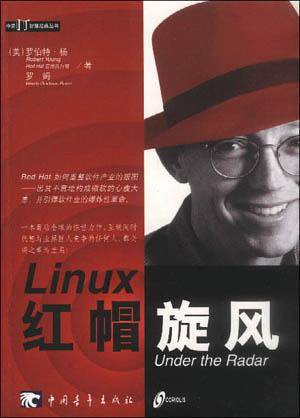

##  书名

《Linux 红帽旋风》

英文原名：《Under the Radar: How Red Hat Changed the Software Business -- and Took Microsoft by Surprise 》

## 封面

## 内容简介

关于红帽公司早期的历史以及它如何彻底改变了软件行业的历程。

RedHat Linux 的成功并不是偶然的，而是在机遇面前抓住了稍瞬即逝的一刻，无论是对开发者的态度，还是资本的运用，以及对于市场的理解。都是值得所有开源从业者学习的。

## 作者简介

### 罗伯特・杨（Robert Young）

红帽公司董事长。短短4年内，罗伯特・杨就带领红帽从一家羽翼未丰的小公司，摇身一变成为全球首屈一指Linux操作系统供应商。累积20年电脑产业的财务与行销经验，罗伯特・杨在1993年目睹Linux热潮的无穷潜力，于是创办一家以Linux发行版和目录服务为主的公司，并在稍后的1995年，与尤英（Marc Ewing）的公司合并组成红帽。红帽的股票首次公开上市造成华尔街的轰动，不仅一新投资人耳目，也为开放源码运动吹起革命的号角。

### 罗姆（Wendy Goldlman Rohm）

著名作家及记者，所著畅销书《微软世纪大审判》赢得美国“1998年最佳非小说类书籍”奖项，并发行9国语言版本。十多年来，罗姆为许多知名杂志及报纸写过专栏，其中包括电脑界知名杂志《连线》、《互动周刊》、《上方》，以及《洛杉矾时报》、《芝加哥论坛报》...

## 推荐理由

开源之史在于过去时空下的每一个细节，每一个小的事件，才能推导出后面的成功，这个过程不能相反的去做，因为成功往往会掩饰很多过往的细节。想要了解RedHat所代表的商业持续发展，这本早期的历史无法错过。

## 推荐人

[适兕](https://opensourceway.community/all_about_kuosi)，作者，「开源之道」主创。「OSCAR·开源之书·共读」发起者和记录者。