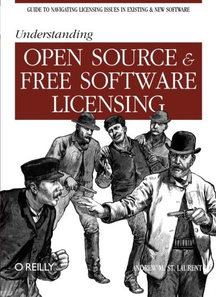

##  书名

《理解开源和自由软件许可》

英文原名：《Understanding Open Source and Free Software Licensing》

## 封面

## 内容简介

在快速浏览了版权法、合同和“开源”的定义之后，这本书处理了许可的范围，包括：

* MIT（或 X）、BSD、Apache 和 Academic Free 许可
* GPL、LGPL 和 Mozilla 许可
* QT、艺术和知识共享许可
* 经典的专有许可
* Sun Community Source 许可和 Microsoft Shared Source 项目
* 本书最后介绍了开源/自由软件许可的法律影响 —— 正面和负面的

## 作者简介

Andrew M. St. Laurent 是一位经验丰富的律师，对知识产权，尤其是软件许可，有着浓厚的兴趣。

## 电子版下载地址

本书遵循 CC协议，可自由下载或线上阅读，扫描下面二维码获取：

## 推荐理由

Upstream first 是一种拥抱开源的绝佳策略，如果仅从技术上讲，可能会被自大的工程师驳回，但是从知识财产法、许可、品牌等角度谈的话，会让人信服很多。本书告诉了你所有的论据。

## 推荐人

[适兕](https://opensourceway.community/all_about_kuosi)，作者，「开源之道」主创。「OSCAR·开源之书·共读」发起者和记录者。