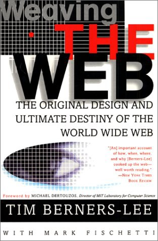

##  书名

《编织万维网:万维之父谈万维网的原初设计与最终命运》

英文原名：《Weaving the Web: The Original Design and Ultimate Destiny of the World Wide Web》

## 封面

## 内容简介

本书主要由两个部分组成：第一部分叙述了万维网诞生的整个过程，它从一个侧面反映了10年来因特网的发展历程，并披露了许多鲜为人知的真实故事；在第二部分中，作者探讨了万维网给社会带来的各种影响和问题，并对万维网未来发展前景提出了个人的设想。正如伯纳斯・李所说，他写作本书并非为了获得名声和荣耀，而是为了与人分享万维网演变的真实经历，与人分享和探讨关于万维网的是非长短，以及更重要 的是，与人分享和探讨对共未来的构想。对于每一个关 心信息的社会和因特网发展前景的人来说，伯纳斯・李“编织万维网”的故事和他对于万维网的心声是绝对体的珍贵历程。

## 作者简介

Tim Berners Lee ，科学家，万维网发明者。

## 推荐理由

深刻改变我们的www，最初是选择GPL，后来又更改为公有领域，极具科学普遍主义的万维网给我们以什么启示？我们获取信息，真的是那么的顺理成章吗？还是有人为我们战斗过，争取过？

## 推荐人

[适兕](https://opensourceway.community/all_about_kuosi)，作者，「开源之道」主创。「OSCAR·开源之书·共读」发起者和记录者。